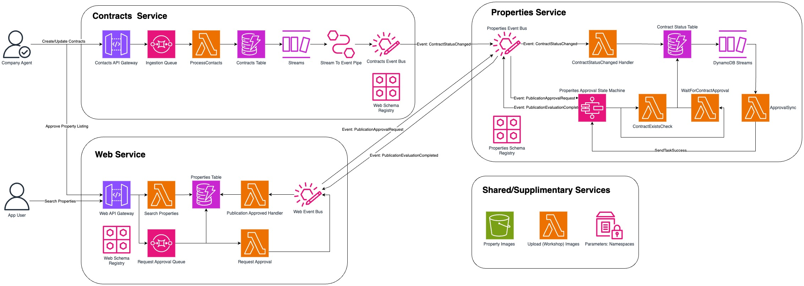

# aws-serverless-developer-ws
## Project Overview

This project is an terraform implementation of the [AWS Serverless Developer Experience Workshop](https://catalog.workshops.aws/serverless-developer-experience/en-US/introduction). The workshop provides a comprehensive guide to building and deploying serverless applications using AWS services. It covers various aspects of serverless development, including API Gateway, Lambda, DynamoDB, Eventbridge and more, to help developers create scalable and efficient serverless solutions.





Real estate company **Unicorn Properties** needs to manage publishing of new property listings and sale contracts linked to individual properties, and provide a way for customers to view approved listings. They adopted a serverless, event-driven architecture with two primary domains: Contracts (managed by Contracts Service) and Properties (managed by Web and Properties Services).

**Unicorn Contracts** (using the `Unicorn.Contracts` namespace) service manages contractual relationships between property sellers and Unicorn Properties, defining properties for sale, terms, and engagement costs.

**Unicorn Properties** (using the `Unicorn.Properties` namespace) service approves property listings by implementing a workflow that checks for contract existence, content and image safety, and contract approval before publishing.

**Unicorn Web** (using the `Unicorn.Web` namespace) manages property listing details (address, sale price, description, photos) to be published on the website, with only approved listings visible to the public.

## Project Structure

The project is organized into several modules, each representing a different part of the Unicorn Properties system:

```
aws-serverless-developer-ws/
.
├── README.md
├── architecture
│   ├── UnicornProperties.drawio
│   └── UnicornProperties.jpg
├── src
│   ├── approvals_service
│   ├── contracts_service
│   ├── image
│   ├── properties_service
│   └── search_service
├── terraform
│   ├── locals.tf
│   ├── main.tf
│   ├── provider.tf
│   ├── shared-infra
│   ├── unicorn-contracts
│   ├── unicorn-properties
│   └── unicorn-web
└── tests
```

- **shared-infra**: Contains shared infrastructure resources.
- **unicorn-contracts**: Manages contractual relationships and property sale contracts.
- **unicorn-properties**: Handles property listings approval workflow.
- **unicorn-web**: Manages the publication of approved property listings on the website.
- **src**: Contains source code for the Lambda Function
- **tests**: Contains tests and files used for manual integration testing

## Installation

To set up the project locally, follow these steps:

1. **Clone the repository**:
    ```sh
    git clone https://github.com/AndreiLesi/aws-serverless-developer-ws.git
    ```

2. **Set up AWS credentials**:
    Ensure you have AWS credentials configured. You can use the AWS CLI to configure your credentials:
    ```sh
    aws configure
    ```

3. **Deploy the infrastructure**:
    Navigate to the `terraform` directory and apply the Terraform configuration:
    ```sh
    cd terraform
    terraform init
    terraform apply
    ```

## Notes

The implementation is **slightly different** than the workshop. Here we focus on **only one** environment